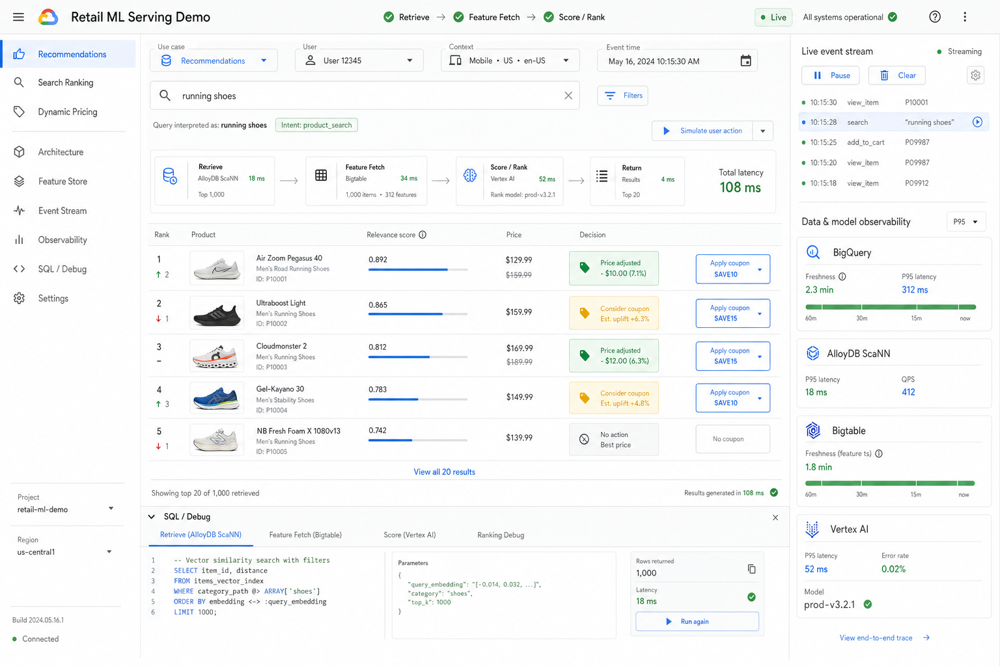

# Retail ML Serving Demo

A deployable retail ML serving demo for the source Google Doc. It shows one shared
retrieve -> feature fetch -> score/rank pipeline powering:

- recommendations
- search ranking
- dynamic pricing + coupons

The repo includes a credential-free local emulator plus live GCP code and
infrastructure for BigQuery, AlloyDB ScaNN, Bigtable, Pub/Sub, Vertex AI, and
Cloud Run. It is published as source for a later live demo deployment; running it
locally does not create cloud resources.



## What It Demonstrates

- BigQuery as the offline feature and embedding compute layer.
- AlloyDB + ScaNN as the catalog/vector/full-text candidate source.
- Bigtable-style row-keyed online features with cell timestamps and freshness SLA.
- Vertex AI-style model scoring for rankers, pricing, and coupon propensity.
- A live event stream emulator that updates item features and downstream decisions.
- Debug visibility for hybrid search SQL, score components, latencies, and freshness.
- Terraform and scripts to provision the live Google Cloud architecture.
- A FastAPI serving layer that switches from emulator clients to real GCP clients with
  `SERVING_MODE=live`.

## Run Locally

```bash
npm ci
npm run dev
```

Then open the local Vite URL shown in the terminal.

To run the API locally in emulator mode:

```powershell
.\scripts\run-api-local.ps1 -Mode emulator -Port 8080
$env:VITE_API_BASE_URL = "http://127.0.0.1:8080"
npm run dev
```

## Validate

```bash
npm run lint
npm test
npm run test:coverage
npm run build
python -m pytest services/api/tests --cov=services/api/app --cov-report=term-missing
python -m ruff check services/api
terraform -chdir=infra/terraform fmt -check -recursive
terraform -chdir=infra/terraform validate
```

Terraform validation requires `terraform init -backend=false` first.

## Deploy To GCP

Read [docs/DEPLOY_GCP.md](docs/DEPLOY_GCP.md). The short path is:

```powershell
$env:TF_VAR_alloydb_password = "REPLACE_WITH_STRONG_PASSWORD"
.\scripts\deploy-gcp.ps1 `
  -ProjectId YOUR_PROJECT `
  -Region us-central1 `
  -Zone us-central1-b `
  -BqLocation US `
  -VertexRankingEndpoint "projects/YOUR_PROJECT/locations/us-central1/endpoints/..." `
  -VertexPricingEndpoint "projects/YOUR_PROJECT/locations/us-central1/endpoints/..." `
  -VertexCouponEndpoint "projects/YOUR_PROJECT/locations/us-central1/endpoints/..."
```

## Repo Guide

- `src/domain/servingEngine.ts` implements the local shared serving pipeline.
- `src/services/servingClient.ts` calls the live API when `VITE_API_BASE_URL` is set.
- `services/api/` contains the FastAPI Cloud Run service and live GCP adapters.
- `src/data/retailDemoData.ts` contains deterministic products, users, online features,
  and point-in-time feature history.
- `src/components/` contains the app shell, results, navigation, and observability UI.
- `infra/terraform/` provisions the live GCP service graph.
- `infra/sql/` contains BigQuery, Bigtable, AlloyDB, and training SQL templates.
- `docs/ARCHITECTURE.md` maps emulator and live mode to the locked architecture.
- `docs/LIVE_ARCHITECTURE.md` shows the live service flow.
- `docs/LOCAL_DEMO_PLAN.md` captures the build and verification plan.
