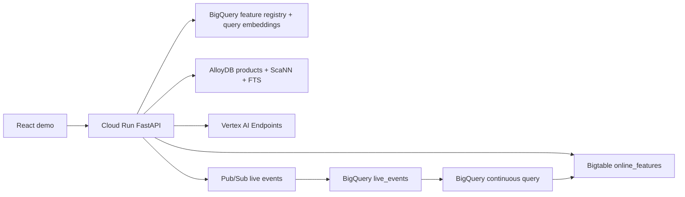

# Live Architecture

The repo now has two execution modes:

- `emulator`: React and FastAPI run with deterministic in-repo data.
- `live`: FastAPI calls Google Cloud services provisioned by Terraform.

## Service Flow

## Ownership

- BigQuery owns feature definitions, embeddings, training sets, and online-sync SQL.
- AlloyDB owns the serving catalog artifact and hybrid candidate retrieval.
- Bigtable owns online point lookups keyed as `user#...` and `item#...`.
- Vertex AI owns ranking, pricing, and coupon scoring endpoints.
- Pub/Sub and BigQuery continuous queries power the live-reaction demo.

## Runtime Boundary

The API never computes feature definitions in application code. It reads the online
rows, sends candidates and features to Vertex AI, enforces pricing floors, and returns
trace/freshness metadata to the UI.
